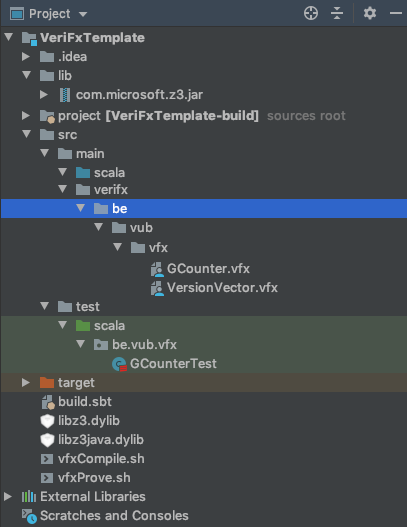
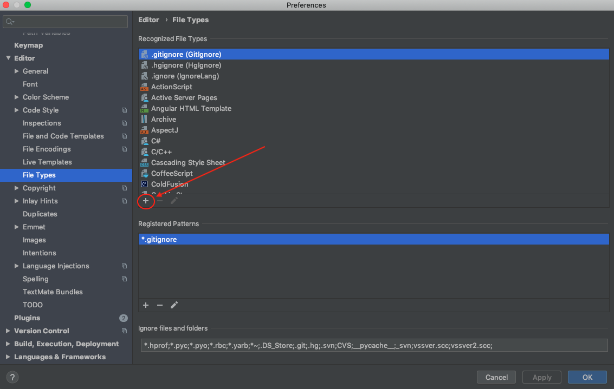
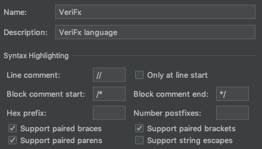

# VeriFx: A High-Level Automated Verification Language

Welcome to VeriFx's repository.
VeriFx is a functional OOP language, inspired by Scala, that supports fully automated verification of high-level correctness properties expressed in VeriFx itself.
In practice, this means that you write programs and their correctness conditions within the same language, without requiring additional annotations or verification hints of any kind. 
The compiler takes care of translating your program to SMT and verifying the provided correctness properties using the Z3 SMT solver.

This repository contains several packages and is structured as follows:
- [templates](templates) contains templates for starting your VeriFx projects 
- [VeriFx-lang](VeriFx-lang) contains the implementation of the VeriFx language itself
- [examples](examples) contains example programs written in VeriFx:
  - [CRDT Verification](examples/CRDT%20Verification) implements and verifies a variety of CRDTs
  - [OT Verification](examples/OT%20Verification) implements and verifies a variety of Operational Transformation functions
  - An overview of these examples and additional information about them can be found in our paper: [VeriFx: Correct Replicated Data Types for the Masses](https://arxiv.org/abs/2207.02502)
- [documentation](documentation) contains the source files that document VeriFx's collections and their API.
  - **The API itself can be found here: TODO**

## Installation

You can start from our [predefined templates](templates) or follow the steps below.

Create a regular Scala project and add VeriFx as a dependency to your `build.sbt` file:
```sbt
libraryDependencies += "be.vub" %% "verifx" % "1.0.0"
```

**Make sure that you have Z3 available on your class path** by adding the Z3 jar to the `lib` folder
and the necessary library files (`libz3.dylib`, `libz3java.dylib` for mac, and `libz3.so`, `libz3java.so` for linux) in the root folder of your project (**cf. the template projects**).
The version of Z3 in your project should match the version of Z3 that is used internally in [VeriFx](VeriFx-lang).

## Code structure

Every VeriFx project should have the following structure:



If you're familiar with Java or Scala, this structure should look familiar.
VeriFx code files go in the `src/main/verifx/` directory.
Importantly, your source files should have the `.vfx` extension in order to be recognized by the compiler as VeriFx source files.
Since this is also a valid Scala project, Scala code files go into `src/main/scala` and test files go into `src/test/scala`.
As we will see later, we often write Scala tests to programmatically verify VeriFx proofs.

## Running your first VeriFx program

VeriFx programs can be executed in order to verify
the correctness properties (called proofs from now on) that are defined by the program.

The fastest way to verify all proofs is to open a terminal and run the `vfxProve.sh` script that is provided in the [templates](templates):
```shell
cd path/to/your/verifx/project
sh vfxProve.sh
```

This script will scan all VeriFx files that are in `src/main/verifx` and verify all proofs within those files (in arbitrary order).
The output will look similar to the screenshot below:


Green indicates proofs that succeeded, red indicates rejected proofs,
and blue indicates proofs that timed out.
For every rejected proof, the counter example will be printed. 

Proofs can also be verified programmatically from within Scala.
To this end you can use the entry points defined in the [ProjectCompiler](VeriFx-lang/src/main/scala/be/vub/verifx/Compiler/ProjectCompiler.scala).
The [example projects](examples) use this API to write Scala unit tests that check the VeriFx proofs.
An explanation on how to use the `ProjectCompiler` can be found in the [VeriFx-lang](VeriFx-lang) package.

## Transpiling VeriFx programs to other languages

VeriFx programs can be transpiled to other languages (currently Scala, JavaScript, and Z3).
To transpile your project use the `vfxCompile.sh` script (which is provided in the [templates](templates)):
```sh
cd path/to/your/verifx/project
sh vfxCompile.sh -l <targetLanguage> [-o <outputDir>]
```

The above script supports two arguments:
- `-l` The target language to transpile the code to, choose one of: `scala`, `js`, or `z3`
- `-o` (Optional) The output directory for transpiled files

You can also transpile VeriFx programs programmatically.
An example can be found in the [CRDT example project](examples/CRDT%20Verification/src/test/scala/be/vub/crdtproofs/CompileToScala.scala).

## IDE Support

We recommend using IntelliJ IDEA for your VeriFx projects.
You can configure IntelliJ IDEA to recognize `.vfx` files in order to get syntax highlighting.
To this end, add a filetype for VeriFx.
In IntelliJ, go to: `Settings... -> Editor -> File Types`.
Then, under "Recognized File Types" click the "+" button:



A pop-up will open. Fill it in like in the screenshot below:



And fill in the following keywords under 1:
```
case
class
def
else
enum
exists
extends
false
forall
if
import
match
new
object
override
private
proof
protected
this
trait
true
val
```

Fill in the following keywords under 4:
```
@recursive
```

Confirm this file type.
Now, register a pattern for it.
Click the "+" button under "Registered Patterns", then enter the following pattern: `*.vfx`.
If everything went well, your VeriFx source files should now be recognised by IntelliJ and have syntax highlighting.
